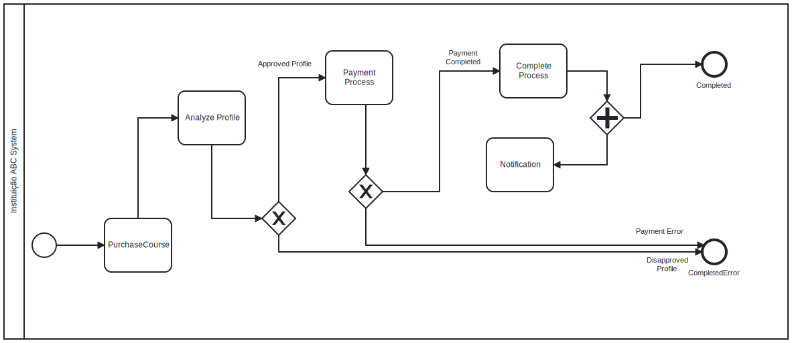

## Architecture

C4 Model

### Context Diagram

### Container Diagram

![container](https://www.plantuml.com/plantuml/png/bLPDSzem4BtpArHw8JCDD3ET7deA8KoJb12AoUJeMTiBQ90bZoH3QAU_feV-aFonhcJpwH18Jewq-_QztTLBBeq5RVDKr3vm6OiyGJQrDZFVMYqDY-Q4ssaUvGPrhAH5QPknIbkP0EboperD18zQdI_d0tVqUDzhfM0iQZeAEvG1NA9kPWw_5jmyF8M3xZ1uw8SFZwFURR_REAlL1gYDaequDrQbg0DB7AJznEhbLttpoGINCqoOLQnzrM5S6ijjRhcIpVhPFj088PwYfkpogxxvV1TGEqcvvCPgi7oE1B9xKA-Sl8rEZLXIYzBmIkKo0Rrin9y9uhQ8uY__NluMUKLO_OpzhjKO_Qpx6NQVRME1KGXPHfbF6B5sbZaUTp074skUKV_QSf8BqEpYmjrq17SDr6Wo9GsF1BAnqYpJQiuJBYVCJf75HH34CHf3l6cGOuZHaTuXq4Zf7YOOqcOGzdtn6xlAZIlr0yOpyCtM8AcSjhuKnL8kuUASYfWgQA68hnNnbQhEHzRlZjZN-kfgSFk64EFRniO8DgUeQXsbQGNyh9GEuzKnOJziNLJgAZsZlTalky5Qzr2bcS1dDXPgKIr-7UsMJwAzkkmQB4HW_5e5FtiiG3qlTZUWQpGUc6P3rLDmE_LA8ptNC8DbMhoaaloWE3XHcXy_n5xOWcp0guj0pfXrStKtIhACt8Dg4Wd7eIAsv53eBEiVbrXcdQPIgp4N6884iJJSRCajRkWX53SdwlP0lrRZTDR7oXe7EKXb-PZ7dkW6kBzrUc9j3xHqjNttQId8HboBUR78VzRcuIoWx7teXX8MQ--xF0bmacjLzx_uaE81xitE8mvHLArtuosFnXVUZbhxwfjH-wPP2VRHwzFDs--048Qiqx6_6Oq6GUkE_c2uX2tbAN2nKHoWJBvhdfHFtriFZGwVgOKqJ8RdBdvb36NNcYM7SBWndbrRSx26hGInF4l0OkbUZc2PVttGK7RX1daak9csWZno5XtXbX4MEFllzhtvXtXK7MU8GDB6MgMqxWbRQ6vnMzEmmkNrNNEZQVafkQRVmunGd3lx8HuMjkCAnxZqNdzbUxCwsjIAJRolkyC3B7OMyMWxBccbw7-X_m00 "container")

## API Entrypoint events

<ul>
    <li>Technology: C#, .NET 6, Kafka and Masstransit</li>
    <li>Description: Web API responsible for providing system features</li>
</ul>

## Analyze Profile

<ul>
    <li>Technology: C#, .NET 6, Kafka and Masstransit</li>
    <li>Description: Worker responsible for analyzing the user profile</li>
</ul>

## Orchestrator

<ul>
    <li>Technology: C#, .NET 6, Kafka, Masstransit and SQL Server</li>
    <li>Description: Worker responsible for orchestrating the complex flows</li>
</ul>

### BPMN Course Purchase Flow

## Notification

<ul>
    <li>Technology: C#, .NET 6, Kafka and Masstransit</li>
    <li>Description: Worker responsible for notifying interested parties</li>
</ul>

## Payment

<ul>
    <li>Technology: C#, .NET 6, Kafka, Masstransit and SQL Server</li>
    <li>Description: Worker responsible for interacting with the bank transaction partner</li>
</ul>
